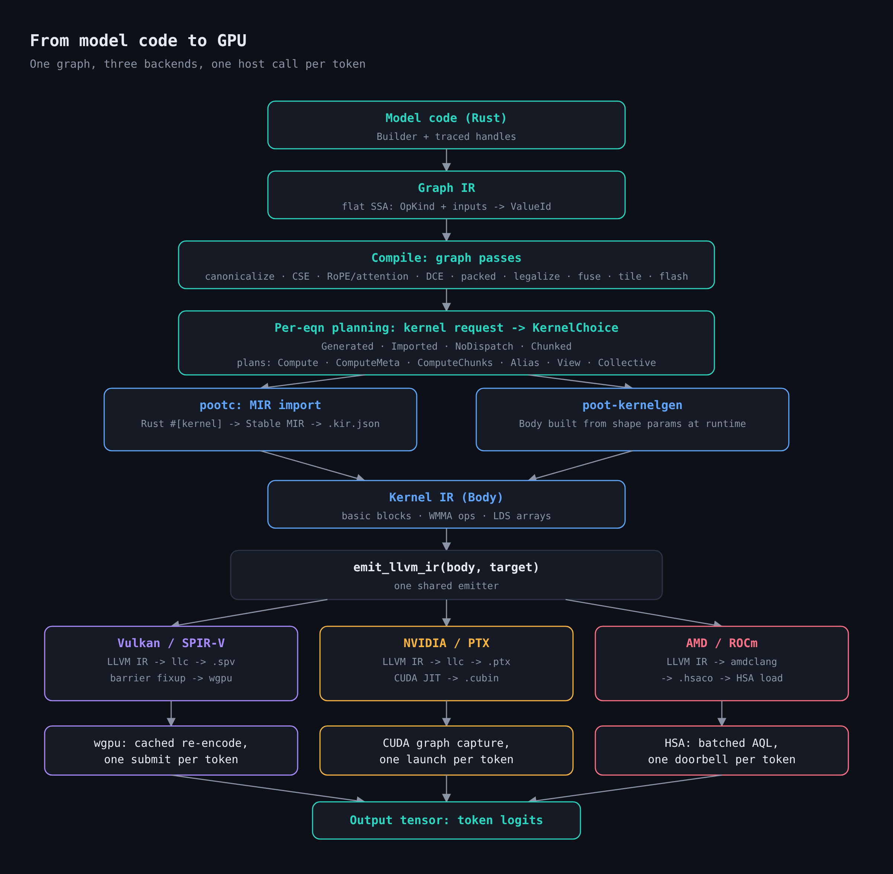
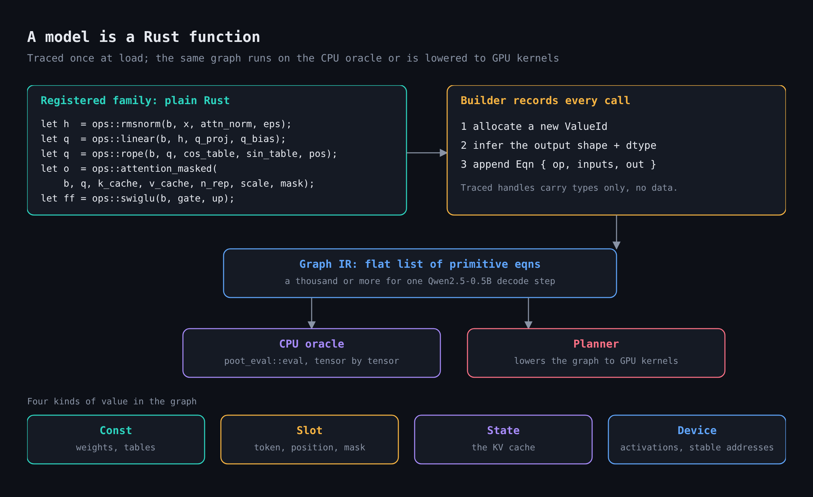
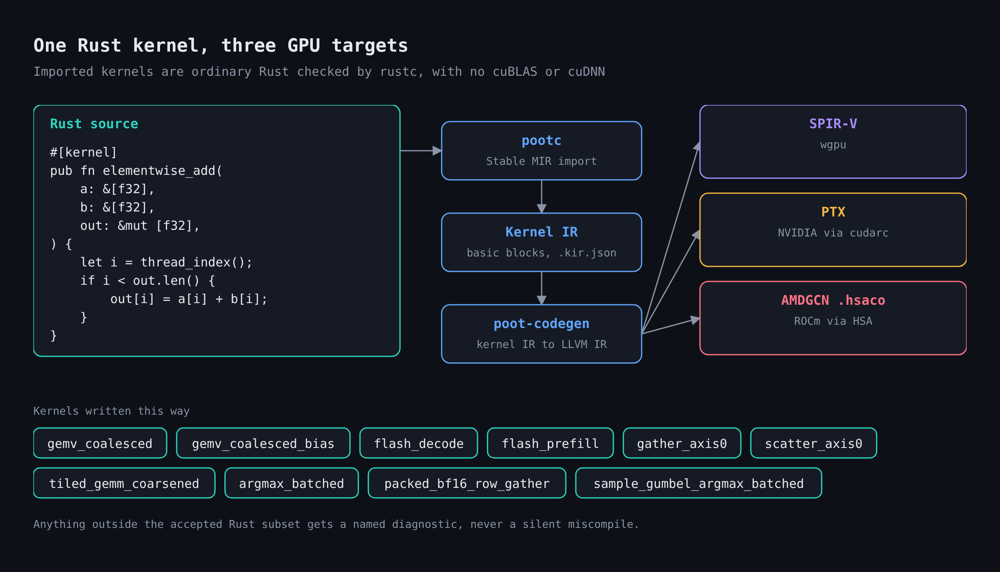
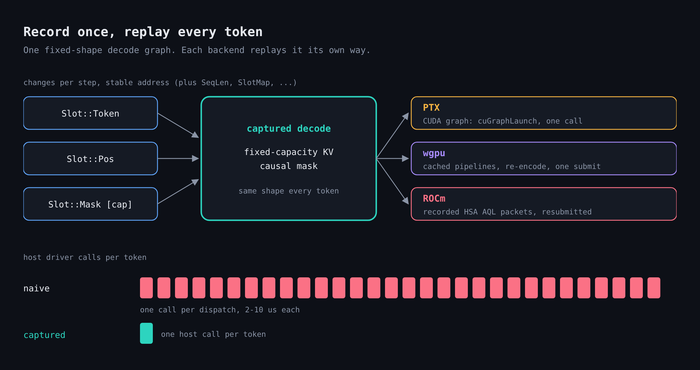

# poot

poot is an LLM inference engine written from scratch in Rust. A model is an ordinary Rust function that is
traced once into a backend-neutral graph of primitive tensor ops. A shared planner and code generator
compile that graph into fused kernels, and the GPU backends (wgpu, ROCm, PTX, raw Vulkan) replay a captured
decode step once per token. There is no cuBLAS and no cuDNN: every kernel is generated or written in Rust.

**[Documentation](https://kikijiki.github.io/poot/)**

## How it works



1. **Model code.** A model family is a config, a weight-name map and a tracer function over shared
   components (`poot-models`). Tracing records equations through `poot_graph_ir::Builder`:

   ```rust
   let h  = ops::rmsnorm(b, x, attn_norm, eps);
   let q  = ops::linear(b, h, q_proj, q_bias);
   let q  = ops::rope(b, q, cos_table, sin_table, pos);
   let o  = ops::attention_masked(b, q, k_cache, v_cache, n_rep, scale, mask);
   let ff = ops::swiglu(b, gate, up);
   ```

2. **Graph IR.** Each helper appends primitive equations (elementwise, reduce, broadcast, matmul, gather,
   view); attention, norms, RoPE and MoE routing are compositions, not opcodes (`poot-graph-ir`). See
   [the graph IR](https://kikijiki.github.io/poot/docs/architecture/graph-ir) and [tracing](https://kikijiki.github.io/poot/docs/architecture/tracing).

   

3. **CPU oracle.** `poot-eval` evaluates the same graph tensor by tensor. It is the reference every
   backend is checked against.

4. **Optimization and planning.** `poot-graph-plan` fuses pointwise, reduction and epilogue work, rewrites
   attention to flash attention, binds packed quantized weights, and chooses a kernel schedule for each
   op. See [fusion and planning](https://kikijiki.github.io/poot/docs/architecture/fusion).

5. **Kernels.** `#[kernel]` Rust functions are imported by the `pootc` rustc driver, and `poot-kernelgen`
   generates bodies for fused ops. Both become kernel IR (`poot-kernel-ir`), which `poot-codegen` lowers to
   SPIR-V, PTX or AMDGCN through LLVM. See [kernels from Rust](https://kikijiki.github.io/poot/docs/architecture/kernel-import).

   

6. **Executors.** `poot-executor` runs a planned graph on a device: `poot-gpu` (wgpu),
   `poot-rocm-gpu` (AMD, raw HSA), `poot-ptx-gpu` (NVIDIA) and `poot-vulkan-device` (raw Vulkan). A decode step is captured once against
   stable buffers and replayed per token: a CUDA graph launch on PTX, resubmitted AQL packets on ROCm, a
   cached command-buffer re-encode on wgpu. `poot-vulkan-device` implements the executor contract over
   `poot-vulkan-runtime`, which drives Vulkan directly. See
   [execution](https://kikijiki.github.io/poot/docs/architecture/execution) and [backends](https://kikijiki.github.io/poot/docs/architecture/backends).

   

7. **Driver.** `poot-llm` runs generation over an executor: `open` a sequence, `step` a batch of rows,
   `commit` tokens, `release` the sequence. It manages the paged KV cache and the prefix cache.
   `poot-serve` exposes an OpenAI-compatible HTTP server. See
   [serving design](https://kikijiki.github.io/poot/docs/architecture/serving-design).

## Try it

```
nix develop        # pinned Rust nightly, LLVM 22, Vulkan stack
just test          # model-free tests: no GPU, no checkpoint
cargo run -p poot-llm --release --features cli --bin qwen2-generate -- /path/to/qwen2.5-0.5b "The capital of France is" 16
```

The model argument is a safetensors directory or a `.gguf` file. Without it the tool reads `qwen2.5-0.5b`
under `POOT_MODELS_DIR`, and tests that load checkpoints read them from the same directory. `--backend
wgpu|rocm|ptx|vulkan` picks the device (ROCm builds with `--features rocm`): wgpu and vulkan need a Vulkan
device, ROCm an AMD GPU, PTX an NVIDIA GPU.

## Repository layout

- `crates/` - the workspace, one crate per stage above, plus `poot-load` and `poot-quant` (checkpoint
  loading and quantized formats) and `poot-runtime*` (device runtimes).
- `benchmarks/` - the cross-framework benchmark suite and its recorded results.
- `crates/poot-orchestrator` - runs the benchmark sweeps on rented RunPod GPUs.
- `website/` - the documentation site (Docusaurus).
- `scripts/` - test-gate and tooling scripts.
